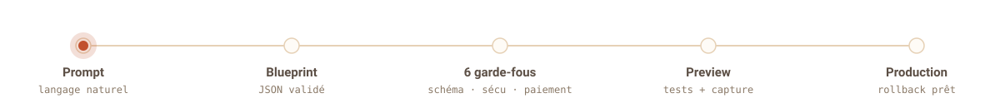

<p align="center">
  
</p>

<h1 align="center">Afrosite</h1>

<p align="center">
  <b>Décrivez votre activité. Repartez avec de quoi vendre et encaisser en Mobile Money —<br>
  en français, en FCFA, sans une ligne de code.</b>
</p>

<p align="center">
  
  
  
  
  
</p>

---

## Le produit

Les TPE/PME africaines — commerçants, restaurants, prestataires — tournent avec WhatsApp, un cahier et Excel. Les créateurs d'apps par IA du marché ne parlent pas Mobile Money, facturent en dollars et s'arrêtent au site vitrine.

**Afrosite** part d'une phrase en langage naturel et personnalise un **blueprint métier éprouvé** (Commerce, Restaurant, Services) — 80 % de composants testés, 20 % de génération contrôlée. Résultat : un mini‑site, la prise de commande, la caisse, le paiement Mobile Money (MTN MoMo, Moov Money), la réconciliation du soir et un résumé WhatsApp. Le socle est identique entre les trois métiers ; seuls les modules spécifiques changent.

> **Principe** : un prompt ne déclenche jamais une action risquée directement. L'IA propose, des règles contrôlent, les tests vérifient, l'humain valide. Afrosite n'est **jamais** dépositaire des fonds — orchestrateur au‑dessus d'un PSP agréé BCEAO.

<p align="center">
  
</p>

---

## L'équipe

<table>
  <tr>
    <td align="center" width="33%">
      <br><br>
      <b>Souraka HAMIDA</b><br>
      <sub>Product Lead · Front‑end · Data / Recherche</sub>
    </td>
    <td align="center" width="33%">
      <br><br>
      <b>CHITOU</b><br>
      <sub>Design Lead · Design System · Design Engineering</sub>
    </td>
    <td align="center" width="33%">
      <br><br>
      <b>SERGE</b><br>
      <sub>Backend · Infra · Paiement · Agents IA</sub>
    </td>
  </tr>
</table>

<details>
<summary><b>Qui possède quoi</b></summary>

<br>

**Souraka HAMIDA — Product Lead · Front‑end · Data / Recherche**
- Vision produit, backlog, priorisation, arbitrages de périmètre
- Contrat `Blueprint JSON` (`packages/contracts`) — la frontière typée front/back
- Architecture front‑end : Next.js, SSR, SEO natif par tenant
- Qualité des prompts & *eval harness* des agents
- Instrumentation des coûts IA/infra par client, unit economics
- Veille & recherche (`deeprecherche_important/`), go‑to‑market pilotes

**CHITOU — Design Lead · Design System · Design Engineering**
- Design system Afrosite : foundations, tokens sémantiques, composants livrés en code
- Patterns par blueprint : POSLayout, KitchenBoard, QRMenu, MobileCheckout…
- Direction artistique, rejet du « slop » IA, conformité charte de marque
- Boucle de critique visuelle : critères écrits, agent UI / Vision Critic
- Accessibilité & Core Web Vitals sur mobile Android / réseau lent

**SERGE — Backend · Infra · Paiement · Agents IA**
- API (FastAPI), modèle de données PostgreSQL, migrations, RBAC multi‑tenant
- Orchestration des agents (LangGraph), workflows durables (Temporal)
- Intégration Mobile Money derrière une couche `PaymentProvider` abstraite
- CI/CD (GitHub Actions), déploiement (Docker Compose + Coolify), sauvegardes
- Sécurité applicative (SAST, scans, 6 gates), ledger immuable, réconciliation

</details>

---

## Démarrage rapide — la landing

```bash
# depuis la racine du dépôt
python -m http.server 5173 --directory landing
# → http://localhost:5173
```

Détails et checklist : [`landing/README.md`](landing/README.md).

---

## Documentation

| # | Document | Contenu |
|---|---|---|
| 00 | [Sommaire](docs/00-README.md) | Comment lire la documentation, principe directeur |
| 01 | [Cahier des charges](docs/01-cahier-des-charges.md) | Vision, périmètre, exigences, critères d'acceptation |
| 02 | [Business model](docs/02-business-model.md) | Canvas, pricing FCFA, unit economics |
| 03 | [Analyse concurrentielle](docs/03-analyse-concurrentielle.md) | Concurrents, SWOT, PESTEL |
| 04 | [Différenciation & positionnement](docs/04-differenciation-positionnement.md) | Le moat défendable, le message |
| 05 | [Roadmap leadership Afrique de l'Ouest](docs/05-roadmap-leadership-afrique.md) | Go‑to‑market, 5 premiers clients, expansion UEMOA |
| 06 | [Architecture technique](docs/06-architecture-technique.md) | Stack, repos open source, pipeline prompt→production, sécurité |
| 07 | [Plan d'exécution 90 jours](docs/07-plan-execution-90-jours.md) | Quoi faire, dans quel ordre |
| 08 | [SEO natif & clonage de sites](docs/08-seo-et-clonage-de-sites.md) | SEO technique, SEO local, garde‑fous légaux |
| 09 | [Branding, logo & positionnement](docs/09-branding-logo-positionnement.md) | Charte visuelle (version texte) |
| 10 | [Ressources de A à Z](docs/10-ressources-de-a-a-z.md) | Toutes les ressources externes, dans l'ordre d'usage |
| 11 | [Playbook d'équipe](docs/11-playbook-equipe.md) | Rôles, RACI, Kanban/Notion, structure des dossiers, branches Git, système de prompts, plan 90 jours |

---

## Stack cible

`Next.js` · `TypeScript` · `FastAPI` · `PostgreSQL` · `Redis` · `LangGraph` · `Temporal` · `LiteLLM` · `Playwright` · `Docker Compose` · `Coolify` · `GitHub Actions`

Arborescence complète du monorepo : [playbook §6.1](docs/11-playbook-equipe.md#61--structure-des-dossiers-arborescence-complète-du-monorepo).

---

## Feuille de route — 90 jours

| Phase | Jours | Objectif |
|---|---|---|
| **1 — Fondation fiable** | 1 → 30 | Socle commun + 3 blueprints, CI, PostgreSQL + sauvegardes, paiement **sandbox** |
| **2 — Automatisation IA** | 31 → 60 | Prompt → Blueprint JSON validé → génération contrôlée, 6 gates automatiques, preview auto |
| **3 — Commercialisation** | 61 → 90 | 5 pilotes à Cotonou en production, paiement réel, résumé WhatsApp, audit sécurité externe |

Décision de fin de phase : les 5 pilotes utilisent‑ils Afrosite **tous les jours** ? Sinon, diagnostiquer avant d'ajouter la moindre fonctionnalité.

---

<p align="center"><sub>FCFA · Mobile Money · Français · Cotonou, Bénin — © 2026 Afrosite</sub></p>
